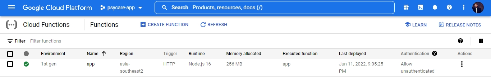
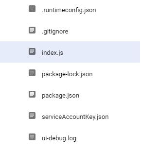

[![Contributors][contributors-shield]][contributors-url]
[![Forks][forks-shield]][forks-url]
[![Stargazers][stars-shield]][stars-url]
[![Issues][issues-shield]][issues-url]
[![MIT License][license-shield]][license-url]

 

  

  

    (Application to detect Depression,anxiety, and stress based on Dass42 and connect people with psychologist) 
     
    <a href="https://github.com/POWERARE/PsycareProject"><strong>Explore the docs »</strong></a>
     
     
    <a href="https://github.com/POWERARE/PsycareProject">View Demo</a>
    ·
    <a href="https://github.com/POWERARE/PsycareProject/issues">Report Bug</a>
    ·
    <a href="https://github.com/POWERARE/PsycareProject/issues">Request Feature</a>
     
     

  
  # Application Demo
   

     
      
  

# Backgrounder

Covid-19 Pandemic is one of the worst pandemic outbreaks in the last 100 years. This causes major problems in many sectors in every country and leads to a total lockdown. This has caused people to lose their jobs all over the world. Besides, there are risks for people to get sick from Covid-19 virus. This situation has led to many people having stress and mental health problems. 
Therefore, our team decided to make an application to help people determine their stress severity and give them suggestions to overcome their problems. This app will also be able to connect people to a psychologist so they’ll be able to share their burden and find a solution.

# Application Creation Flowchart

  

  
  ## DEPLOYMENT STEPS
  <ol><h2> 1. Storing Model to GCP cloud storage</h2></ol>
    <ul>1. Open gcp console </ul>
    <ul>2. Make a cloud storage bucket </ul>
    <ul>3. Store .h5 and .pkl model to cloud storage. </ul>
  
  <ol><h2>2. Create a Cloud Firestore database</h2></ol>
  	<ul>1. If you haven't already, create a Firebase project: In the Firebase console, click Add project, then follow the on-screen instructions to create a Firebase project or to add Firebase services to an existing GCP project.</ul>
  	<ul>2. Navigate to the Cloud Firestore section of the Firebase console. You'll be prompted to select an existing Firebase project. Follow the database creation workflow.</ul>
  	<ul>3. Select a starting mode for your Cloud Firestore Security Rules</ul>
  	<ul>4. Select a location for your database.</ul>

   <ol><h2>3. Create function</h2></ol>
  	<ul>1. Open the Functions Overview page in the Cloud console: 
  <a href="https://console.cloud.google.com/functions">Go to the Cloud Functions Overview page</a>
   Make sure that the project for which you enabled Cloud Functions is selected.</ul>
  	<ul>2. Click Create function.</ul>
  	<ul>3. For the Environment, select 1st gen.</ul>
  	<ul>4. Name your function</ul>
  	<ul>5. In the Trigger field, select HTTP.</ul>
  	<ul>6. In the Authentication field, select Allow unauthenticated invocations.</ul>
  	<ul>7. Click Save to save your changes, and then click Next.</ul>
  	<ul>8. Use the Runtime dropdown to select your desired language runtime.</ul>

  <ol><h2>4. Deploy the function</h2></ol>
  	<ul>1. At the bottom of the page, click Deploy.</ul>
  	<ul>2. After clicking Deploy, Cloud console redirects to the Cloud Functions Overview page.</ul>
    

  

  <ol><h2>5. Set up Node.js and the Firebase CLI</h2></ol>
    	Once you have Node.js and npm installed, install the Firebase CLI via your preferred method. To install the CLI via npm, use: 

  	 npm install -g firebase-tools

  <ol><h2>6. Initialize your project</h2></ol>
  	When you initialize Firebase SDK for Cloud Functions, you create an empty project containing dependencies and some minimal sample code, and you choose either TypeScript or JavaScript for composing functions.
  	In this project have function structure like this:
    
-----

  

-------
<ol><h2>7.  Import the required modules and initialize an app</h2></ol>

    // The Cloud Functions for Firebase SDK to create Cloud Functions and set up triggers.
    const functions = require('firebase-functions');

    // The Firebase Admin SDK to access Firestore.
    const admin = require('firebase-admin');
    admin.initializeApp();
# API Endpoint
|     Endpoint                         |   Method      | Body Sent (JSON) |              Description                       |
|:-----------------------------------: | :-----------: | :--------------: | :--------------------------------------------: |
| /api                                 |     GET       |       None       |   HTTP GET REQUEST Testing Endpoint            |
| /api/users                           |    POST       |     Anything     |   HTTP POST REQUEST Testing Endpoint           |
| /api/users/:userId                   | PUT & GET     |     Anything     |   HTTP PUT & GET REQUEST Testing  endpoint     |
| /api/users/fav/:userId               | POST & DELETE |     Anything     |   HTTP POST & DELETE REQUEST  Endpoint         |
| /api/users/histories/:userId         | GET           |     Anything     |   HTTP GET REQUEST Testing Endpoint            |
| /api/discussions                     | POST & GET    |     Anything     |   HTTP POST & GET REQUEST Testing Endpoint     |
| /api/discussions/reply/:discussionId | POST & GET    |     Anything     |   HTTP POST & GET REQUEST Testing Endpoint     |
| /api/psikolog                        | GET           |     Anything     |   HTTP GET REQUEST Testing Endpoint            |
| /api/predict/:userId                 | POST          |     Anything     |   HTTP POST REQUEST Testing Endpoint           |
| /api/discussions                     | POST & GET    |     Anything     |   HTTP POST & GET REQUEST Testing Endpoint     |

   

     
  
<!-- MARKDOWN LINKS & IMAGES -->
<!-- https://www.markdownguide.org/basic-syntax/#reference-style-links -->
[contributors-shield]: https://img.shields.io/github/contributors/POWERARE/PsycareProject.svg?style=for-the-badge
[contributors-url]: https://github.com/POWERARE/PsycareProject/graphs/contributors
[forks-shield]: https://img.shields.io/github/forks/POWERARE/PsycareProject.svg?style=for-the-badge
[forks-url]: https://github.com/POWERARE/PsycareProject/network/members
[stars-shield]: https://img.shields.io/github/stars/POWERARE/PsycareProject.svg?style=for-the-badge
[stars-url]: https://github.com/POWERARE/PsycareProject/stargazers
[issues-shield]: https://img.shields.io/github/issues/POWERARE/PsycareProject.svg?style=for-the-badge
[issues-url]: https://github.com/POWERARE/PsycareProject/issues
[license-shield]: https://img.shields.io/github/license/POWERARE/PsycareProject.svg?style=for-the-badge
[license-url]: https://github.com/POWERARE/PsycareProject/blob/master/LICENSE
[linkedin-shield]: https://img.shields.io/badge/-LinkedIn-black.svg?style=for-the-badge&logo=linkedin&colorB=555
